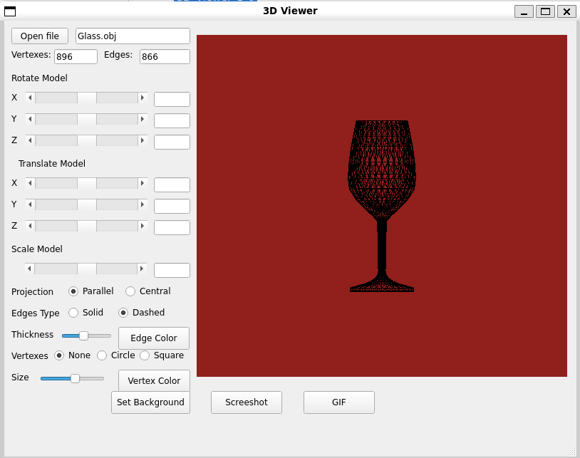

# 3DViewer_v2.0

3DViewer_v2.0 is a program for visualizing 3D wireframe models. With it, you can open .obj files and view 3D wireframe models. Also you can configure model, projection type and background.

